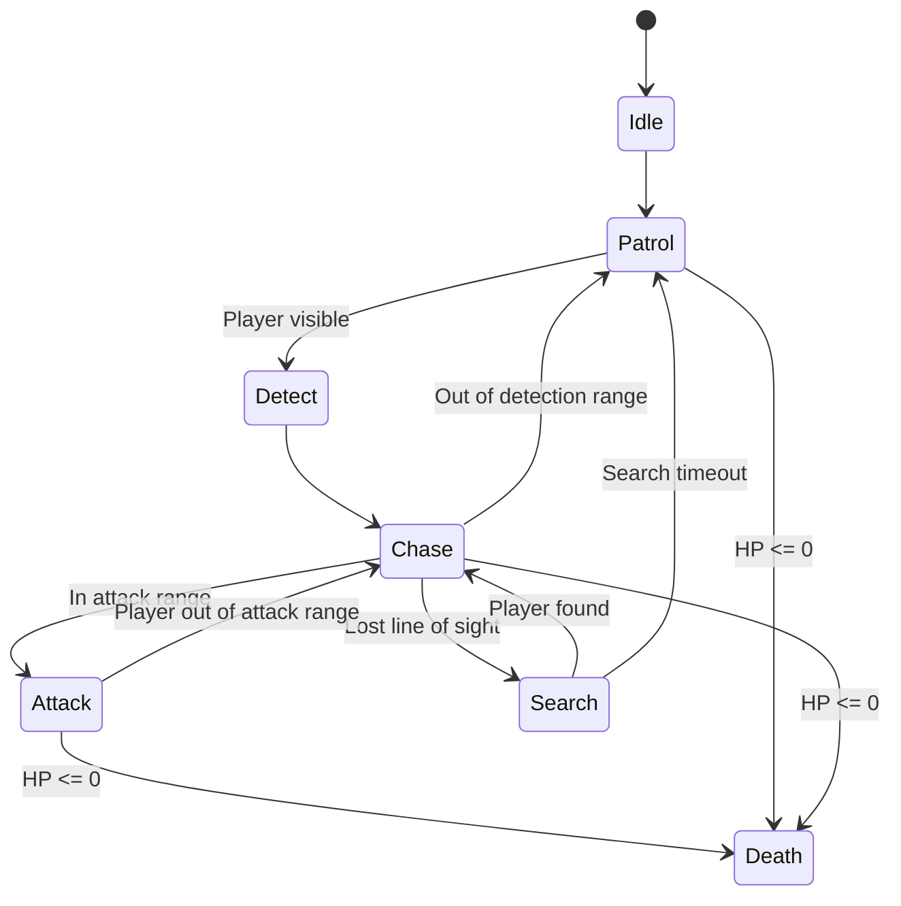
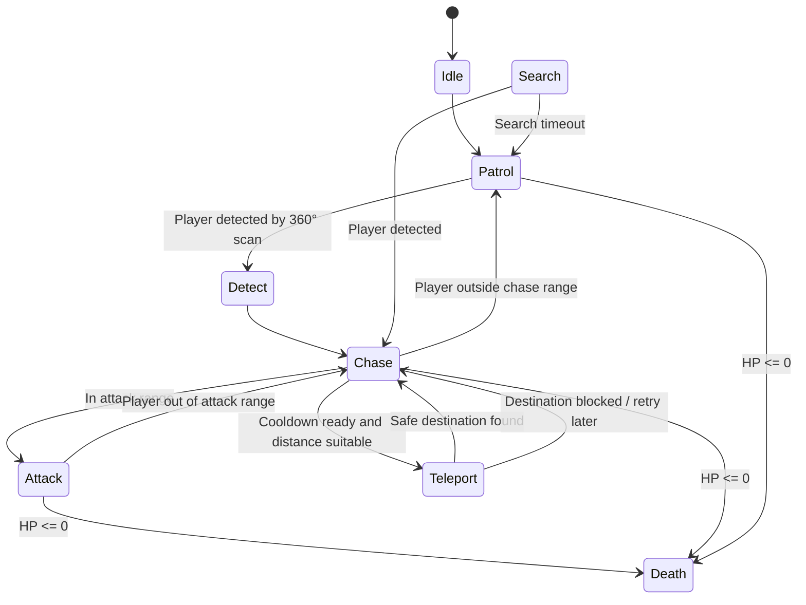

# FSM Diagrams

## Normal Enemy

```mermaid
stateDiagram-v2
    [*] --> Idle
    Idle --> Patrol
    Patrol --> Detect: Player visible
    Detect --> Chase
    Chase --> Attack: In attack range
    Chase --> Search: Lost line of sight
    Chase --> Patrol: Out of detection range
    Search --> Chase: Player found
    Search --> Patrol: Search timeout
    Attack --> Chase: Player out of attack range
    Attack --> Death: HP <= 0
    Patrol --> Death: HP <= 0
    Chase --> Death: HP <= 0
```

## Teleporting Enemy

```mermaid
stateDiagram-v2
    [*] --> Idle
    Idle --> Patrol
    Patrol --> Detect: Player detected by 360° scan
    Detect --> Chase
    Chase --> Attack: In attack range
    Chase --> Teleport: Cooldown ready and distance suitable
    Chase --> Patrol: Player outside chase range
    Search --> Chase: Player detected
    Search --> Patrol: Search timeout
    Teleport --> Chase: Safe destination found
    Teleport --> Chase: Destination blocked / retry later
    Attack --> Chase: Player out of attack range
    Attack --> Death: HP <= 0
    Chase --> Death: HP <= 0
    Patrol --> Death: HP <= 0
```
