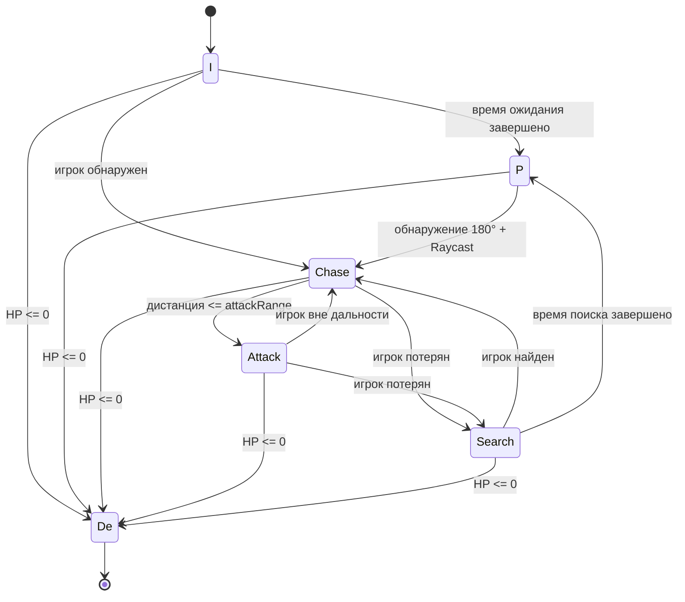
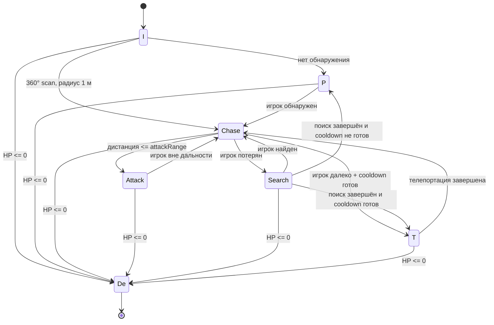

# Лабораторная работа №1
## Проектирование поведения NPC с использованием конечного автомата состояний

### Цель работы
Изучить принцип конечного автомата состояний (FSM) и применить его для реализации поведения двух типов вражеских NPC в Unity 2D.

### Использованные состояния
Оба врага используют состояния:
- **Idle (I)** — ожидание;
- **Patrol (P)** — движение по точкам патрулирования;
- **Detect (D)** — логический этап обнаружения игрока;
- **Chase** — преследование;
- **Attack / Fight (F)** — атака с дальностью, уроном и перезарядкой;
- **Search (S)** — движение к последней известной позиции;
- **Death (De)** — смерть и остановка поведения.

Телепортирующийся противник дополнительно имеет состояние **Teleport (T)**.

### Обычный противник
Обычный противник обнаруживает игрока в пределах заданной дальности и поля зрения 180°. Сначала проверяется расстояние, затем угол между направлением NPC и направлением на игрока. После этого используется Raycast, чтобы убедиться, что между NPC и игроком нет стены.

После обнаружения NPC переходит в Chase. При достижении дальности атаки происходит переход в Attack. Если игрок исчезает из поля зрения, NPC переходит в Search, направляется к последней известной позиции и после истечения времени поиска возвращается в Patrol.

### Телепортирующийся противник
Телепортирующийся NPC периодически выполняет круговое сканирование 360° с радиусом 1 метр. Для сканирования используется `Physics2D.OverlapCircleAll`, после чего видимость проверяется через Raycast.

Телепортация доступна после окончания cooldown. Враг пытается переместиться на заданную дистанцию от игрока. Перед телепортацией проверяется, не попадает ли новая позиция внутрь препятствия. После завершения способности NPC возвращается в Chase.

### Условия переходов
| Текущее состояние | Условие | Следующее состояние |
|---|---|---|
| Idle | Игрок обнаружен | Chase |
| Idle | Время ожидания закончилось | Patrol |
| Patrol | Игрок обнаружен | Chase |
| Chase | Дистанция ≤ дальности атаки | Attack |
| Chase | Игрок потерян | Search |
| Chase | Игрок далеко и cooldown готов | Teleport (только телепортирующийся NPC) |
| Attack | Игрок вышел из дальности атаки | Chase |
| Attack | Игрок потерян | Search (обычный NPC) |
| Search | Игрок снова обнаружен | Chase |
| Search | Поиск завершён | Patrol или Teleport |
| Teleport | Проверка позиции успешна | Chase |
| Любое состояние | HP ≤ 0 | Death |

### Схемы FSM

#### Обычный противник

#### Телепортирующийся противник

### Почему используется Raycast
Одного расстояния недостаточно: игрок может находиться за стеной. Raycast проверяет прямую видимость между NPC и игроком и предотвращает обнаружение через препятствия.

### Преимущества FSM
- понятная структура поведения;
- простое добавление новых состояний;
- удобная отладка через текущий State;
- предсказуемые переходы.

### Ограничения FSM
При большом количестве состояний число переходов может быстро увеличиваться. Для сложного поведения можно использовать иерархические FSM, Behaviour Tree или Utility AI.

### Ответы на контрольные вопросы
1. **FSM** — модель поведения, состоящая из состояний и переходов между ними.
2. **Состояние** описывает текущее поведение, а **переход** — условие смены поведения.
3. Idle, Patrol, Chase, Attack, Search и Death; для второго врага также Teleport.
4. Расстояние не показывает, есть ли между NPC и игроком препятствие.
5. Поле зрения реализуется через проверку дальности и угла между направлением NPC и направлением на игрока.
6. Raycast проверяет прямую видимость и наличие стены.
7. 180° ограничивает обнаружение передней полусферой, а 360° позволяет обнаруживать вокруг NPC.
8. FSM проста и предсказуема, но при усложнении проекта может иметь слишком много переходов.
9. Нужно определить приоритеты. В реализации сначала проверяется смерть, затем атака/дистанция, затем обнаружение и остальные условия.
10. Можно создать новый класс NPC, унаследованный от базового FSM, и добавить уникальные состояния и условия переходов.

### Демонстрация
Во время демонстрации следует показать патрулирование, обнаружение, преследование, атаку, потерю игрока, поиск, возвращение к патрулированию, 360°-сканирование и телепортацию. В Inspector или через Debug.Log можно отображать текущее состояние NPC.

### Вывод
В работе была разработана система поведения NPC на основе FSM. Обычный противник использует направленное поле зрения 180° и Raycast, а телепортирующийся противник — периодическое круговое сканирование 360° и ограниченную телепортацию. Оба врага имеют состояние Death, которое завершает их активное поведение.
